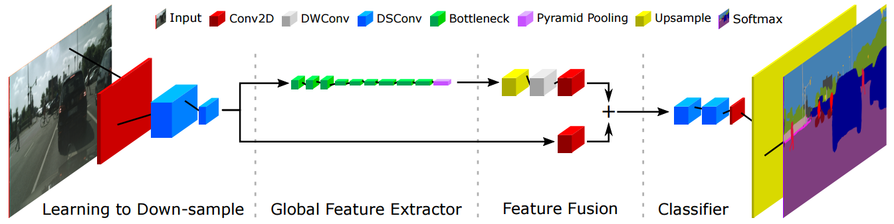

# Fast-SCNN: Fast Semantic Segmentation Network
A PyTorch implementation of [Fast-SCNN: Fast Semantic Segmentation Network](https://arxiv.org/pdf/1902.04502) from the paper by Rudra PK Poudel, Stephan Liwicki.

<p align="center"></p>

# Results
|Method|Dataset|crop_size|mIoU|pixAcc|
|:-:|:-:|:-:|:-:|:-:|
|Fast-SCNN(paper)|cityscapes||||
|Fast-SCNN(ours)|cityscapes|768|54.84%|92.37%|

Note: The result based on crop_size=768, which is different with paper.


&emsp;&emsp;&emsp;&emsp;&emsp;&emsp;(a) test image &emsp;&emsp;&emsp;&emsp;&emsp;&emsp;&emsp;&emsp;&emsp;&emsp;&emsp;(b) ground truth &emsp;&emsp;&emsp;&emsp;&emsp;&emsp;&emsp;&emsp;&emsp;&emsp;(c) predicted result

## train, evaluation
### pretrain with city4sig
```
CUDA_VISIBLE_DEVICES=0 python train.py --resize 1024 --base-size 512 --crop-size 384 --batch-size 48 --lr 0.04 --weight-decay 0.0004 --train_img_dir city4sig_pretrain/img1024_norm --train_mask_dir city4sig_pretrain/gt1024 --epoch 200
```
### finetune with signate dataset
```
CUDA_VISIBLE_DEVICES=0 python train.py --resize 1024 --base-size 512 --crop-size 384 --batch-size 48 --lr 0.005 --weight-decay 0.00005 --train_img_dir seg_train_images/1024_norm --train_mask_dir seg_train_annotations/1024 --use_weight --resume ./weights13pre_004/fast_scnn_1024_pre_best.pth --stage fine --epoch 200
```
### evaluation and runtime measurement 
```
CUDA_VISIBLE_DEVICES=0 kernprof -l eval.py --resize 1024 --base-size 512 --crop-size 384 --sub_out_dir 1024 --model_path fast_scnn_1024_fine_best.pth --save-folder 

python -m line_profiler eval.py.lprof >> inferrence_time.txt
```
### IoU measurement
- make gt json
```
python make_submit.py --path_to_annotations ../signate_datasets/seg_val_annotations --output_name gt
```
- make pred json
```
python signate_metrics/make_submit.py --path_to_annotations ../test_result/1024 --output_name 1024
```

- calculate IoU
```
python signate_metrics/IOU.py --path_to_ground_truth gt.json --path_to_prediction 1024.json
```
